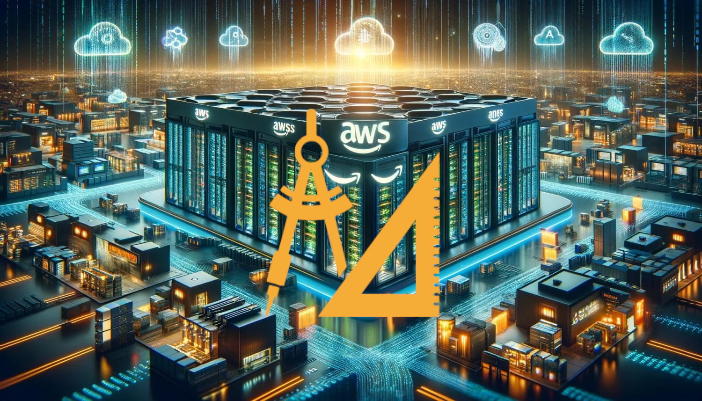

# Welcome to this CDK project for AWS Solution Architect Associate

## **Abstract**

_**Disclaimer**: Please note that executing this project will end in charging your account. Check what you're going to build before running it._

This project was created to support the delivery of a _Architecting on AWS_ course using cdk (TypeScript).  
The **_cdk_** utility will create for you preconfigured services to enrich with live demos the explaination.

## **Prerequisites**

To fully use this project you'll need to configure

- **awscli** --> [installation instruction](https://docs.aws.amazon.com/cli/latest/userguide/getting-started-install.html)  
   Once you have installed it you need to configure the awscli

  ```bash
  $ aws configure
  ```

  **_Administrator_** rights are required to bootstrap the infrastructure

- **cdk**  
   To install cdk you should have _npm_ and _node.js_ **v12+**  
   Than you can install it with
  ```bash
  $ npm install -g aws-cdk
  ```
- **(Optional) python/node/java runtimes** if you want to run every sdk example in the project  
  Versions used during the creation:

  - Python 3.10.11
  - Node v24.4.1
  - Java openjdk 17

- **(Optional) Docker** to build and upload a demo docker image to ***ECR***

## **Bootstrap Resources**

Before the course start the project must be bootstrapped to prepare resources.

1. Customize your Stack **modifying variables in [`.env`](./.env) file**

- _NICKNAME_ - to have a personalization in buckets name
- _EMAIL_ - to use as a subscription of SNS topic

2. Dependencies preparation.  
   From the root directory of the project run the command

   ```bash
   $ npm install
   ```

3. **_cdk_** preparation.  
   In order to let cdk create resources on your account the utility must be initialized.  
   From the root directory of the project run the command
   ```bash
   $ cdk bootstrap
   ```
   Ensure your _awscli_ is configured with administrator rights for this command to succed
4. **_cdk_** deploy.  
   To actually create _CloudFormation_ Stacks with wanted resources
   ```bash
   $ cdk deploy --all
   ```
   ⚠️**NOTE**⚠️  
   *This command will start creating resources and using your billing/credits.*
5. An email will be sent to the configured address in _.env_ file.  
   Check it and confirm the subscription in order to receive future SNS Topic messagges

## **How to Use the project**

A step by step guide on how to use demos during the course modules

### **[Module 1 - Interactin with AWS](./mod01-aws_interaction/README.md)**
### **[Module 2 - Exploring IAM](./mod02-iam/README.md)**
### **[Module 3 - Networking 1](./mod03-networking1/README.md)**
### **[Module 4 - Compute](./mod04-compute/README.md)**
### **[Module 5 - Storage Solutions](./mod05-storage/README.md)**
### **[Module 6 - Database Solutions](./mod06-database/README.md)**
### **[Module 7 - Monitoring & Scaling](./mod07-autoscaling/README.md)**
### **[Module 8 - Automation](./mod08-automation/README.md)**
### **[Module 9 - Containers](./mod09-containers/README.md)**
### **[Module 10 - Networking 2](./mod10-networking2/README.md)**

## **Clean up**

To destroy everything that was created by cdk

```bash
$ cdk destroy --all
```

Any other resource created manually during the course (like in [Module 1 examples](./mod01-aws_interaction/README.md)) won't be seen by cdk and you'll need to delete them manually.  
⚠️⚠️⚠️ **Remember to clean them!** ⚠️⚠️⚠️

